```mermaid
sequenceDiagram
    participant U as User 
    participant TM as Ticket Master
    participant R as Redis
    participant RQ as RabbitMQ

    U ->> TM: Post /booking {event_id}
    TM ->> R: Booking request
    R ->> R: Lua: duplicate wait_list check. zrangebylex
    alt exists
        R ->> R: get score and return
    else
        R -->R: calculate sequence and add to waiting_list
    end 
    rect rgb(23,27,27)
        alt new
            Note over R: Async
            R -->> RQ: publish event to `booking_request`
        end
        end
    R -->> TM: Success
    TM --> U: {token, status: queued}

```

**API:** `POST /api/booking/request`
**Request**
```json
{
  "event_id": "event_x",
  "user_id": 1
}
```
**Response**
```json
{
  "existed": true,
  "sequence": 10
}
```



```
local score = redis.call('zscore','waiting_list:'..event_id, user_id)
if score then return {0, score} end

local sequence = redis.call('incr', 'queue_sequence'..event_id)
redis.call('zadd', 'waiting_list'..event_id, sequence, user_id)
return {1, sequence}
```