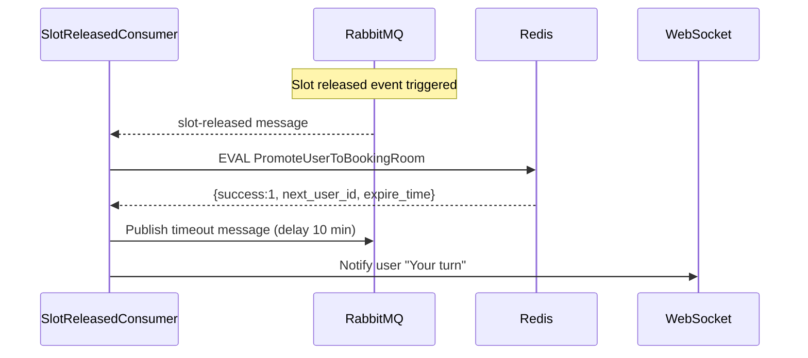

**API:** `GET /api/booking/select-seat`



```
local rank = redis.call('zrank', 'waiting_list:'..event_id, user_id)
ir rank then
    return {queued, rank + 1}
end
if redis.call('zscore', 'active_users:'..event_id, user_id) then
    local state = redis.call('hget','user_state:'..user_id..':'..event_id, 'state')
       
```