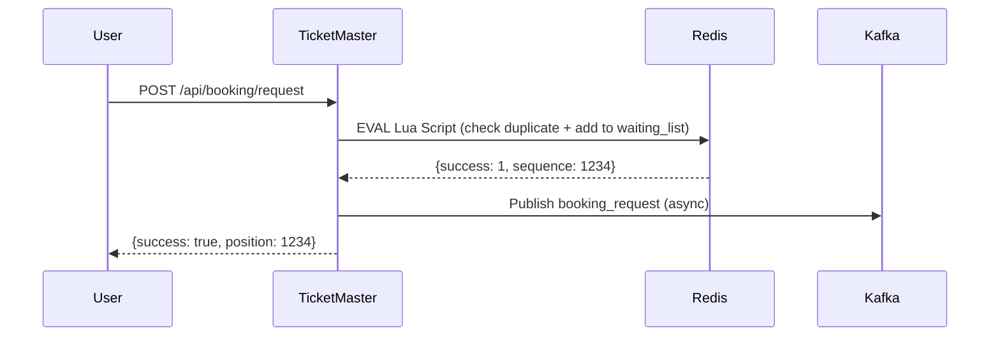
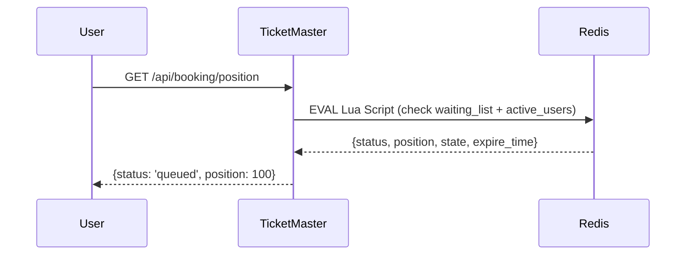
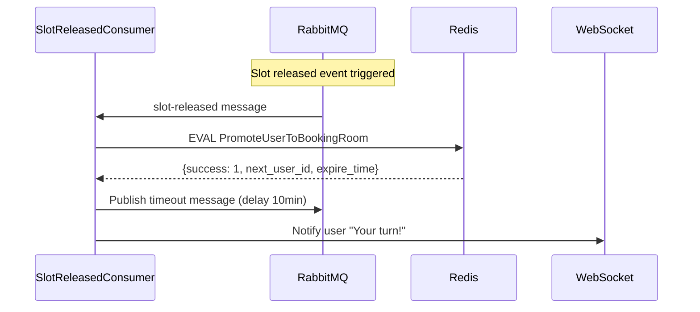
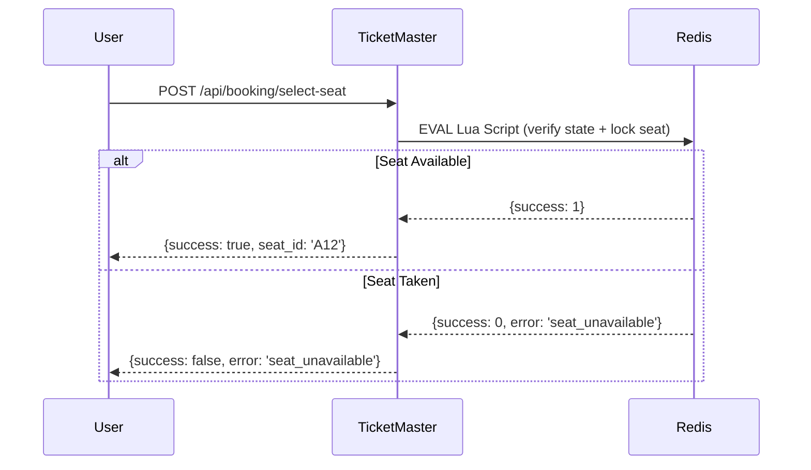
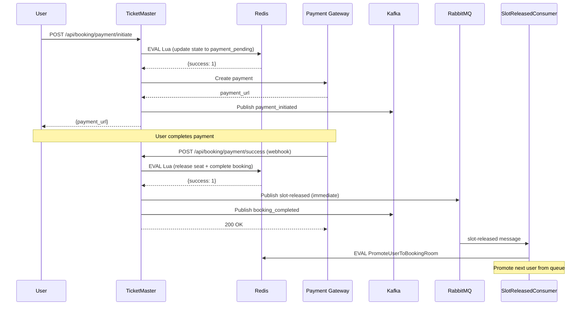
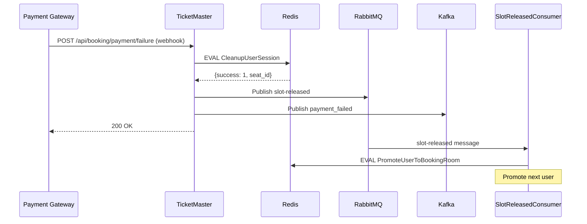
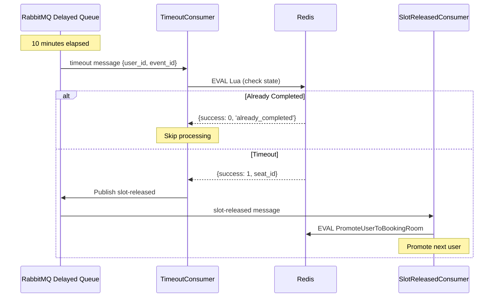
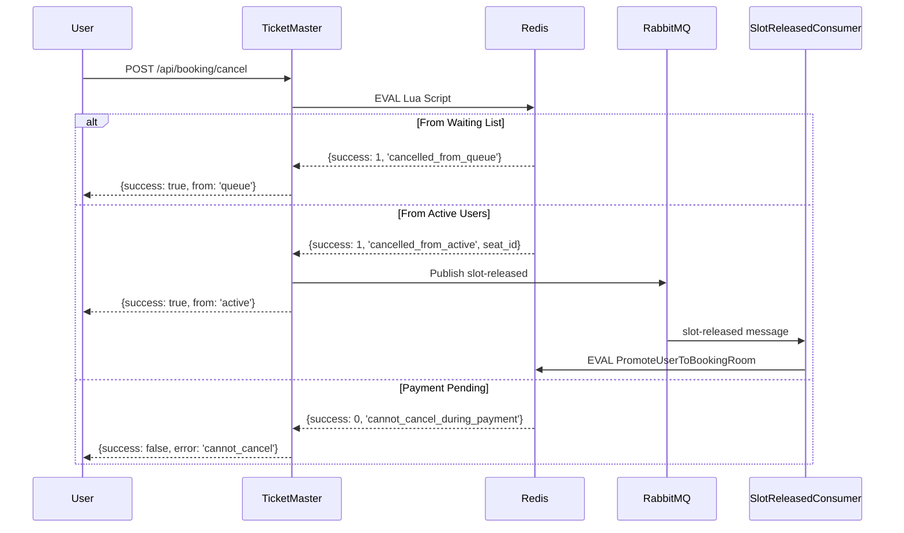
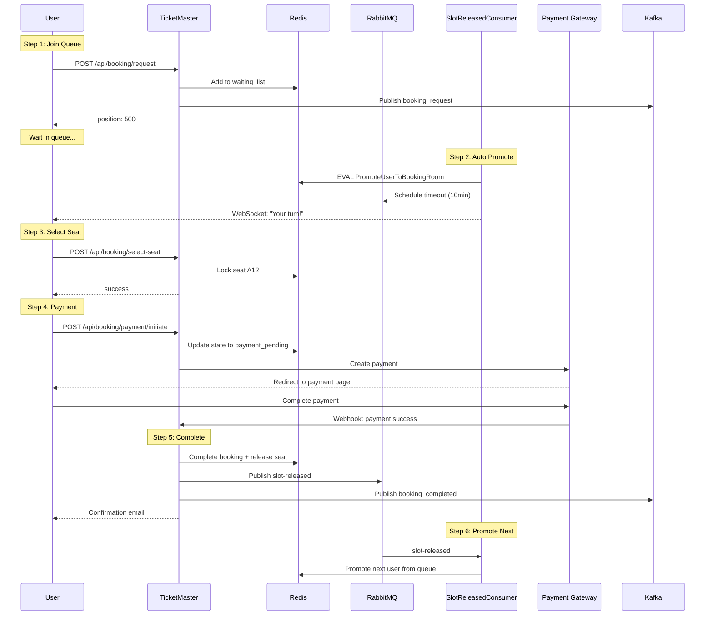
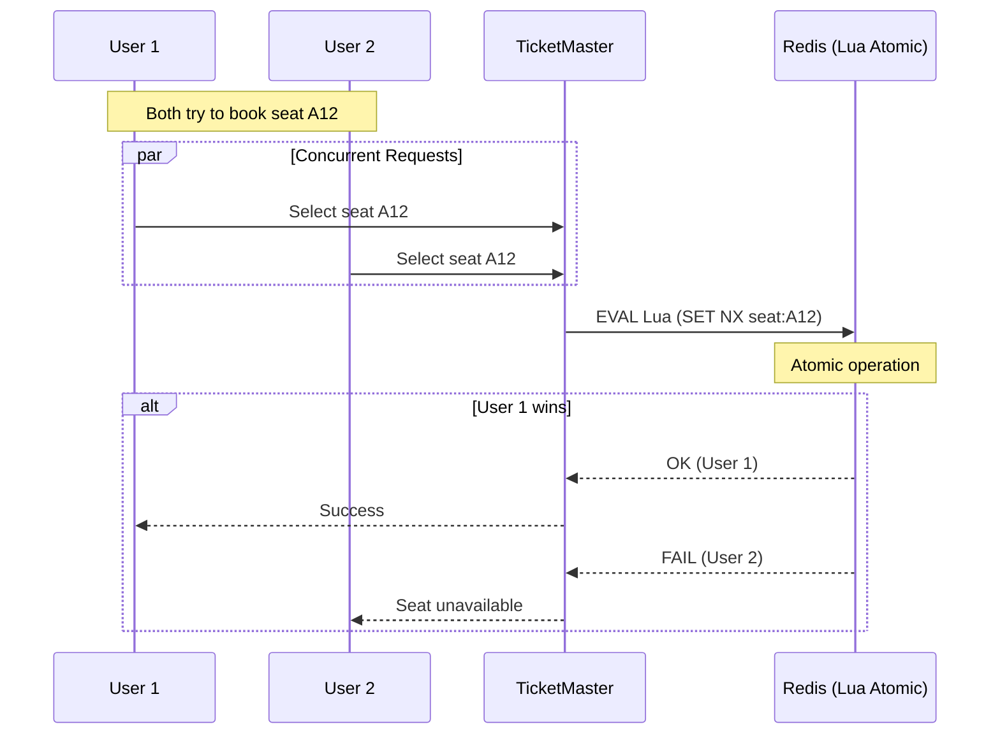

# TICKETMASTER SEQUENCE DIAGRAMS

## 1. User Request Booking



*Kafka Messages:*

Topic: booking_request
```json
{
"user_id": "user_123",
"event_id": "event_456",
"sequence": 1234,
"timestamp": 1234567890
}
```

*Redis Lua Scripts:*
``` lua
-- Enqueue to waiting_list
local event_id = ARGV[1]
local user_id = ARGV[2]

-- Check duplicate
local score = redis.call('zscore', 'waiting_list:'..event_id, user_id)
if score then return {0, score} end

-- Add to waiting list
local sequence = redis.call('incr', 'queue_sequence:'..event_id)
redis.call('zadd', 'waiting_list:'..event_id, sequence, user_id)

return {1, sequence}
```
---

## 2. Get Queue Position


*Redis Lua Scripts:*
``` lua
-- Get Queue Position
local user_id = ARGV[1]
local event_id = ARGV[2]

-- Check waiting_list
local score = redis.call('zscore', 'waiting_list:'..event_id, user_id)
if score then
local rank = redis.call('zrank', 'waiting_list:'..event_id, user_id)
return {'queued', rank + 1, score}
end

-- Check active_users
if redis.call('zscore', 'active_users:'..event_id, user_id) then
local state = redis.call('hget', 'user_state:'..user_id..':'..event_id, 'state')
local seat_id = redis.call('hget', 'user_state:'..user_id..':'..event_id, 'seat_id')
local expire_time = redis.call('hget', 'user_state:'..user_id..':'..event_id, 'expire_time')
return {'active', state, seat_id, expire_time}
end

return {'not_found', nil, nil}
```
---

## 3. Auto Promote User (Background Process)


*RabbitMQ Messages:*

- Exchange: slot-released-exchange 
- Queue: slot-released-queue 
- Routing Key: slot-released
```json
{
  "event_id": "event_456",
  "reason": "timeout|payment_success|payment_failure|cancellation",
  "timestamp": 1234567890
}
```
- Exchange: timeout-exchange (delayed)
- Queue: timeout-queue
- Routing Key: timeout
- Delay: 600000ms (10 minutes)
```json
{
  "user_id": "user_123",
  "event_id": "event_456",
  "expire_time": 1234567890,
  "scheduled_at": 1234567890
}
```
**Redis Lua Scripts:**

```lua
-- PromoteUserToBookingRoom
local event_id = ARGV[1]
local current_time = tonumber(ARGV[2])
local timeout_seconds = 600

-- Check capacity
local limit = 1000
local count = redis.call('zcard', 'active_users:'..event_id)
if count >= limit then
    return {0, 'room_full'}
end

-- Pop next user from waiting_list
local next = redis.call('zpopmin', 'waiting_list:'..event_id, 1)
if not next[1] then
    return {0, 'no_waiting'}
end

local next_user_id = next[1]

-- Add to active_users
local expire_time = current_time + timeout_seconds
redis.call('zadd', 'active_users:'..event_id, expire_time, next_user_id)

-- Create user_state
redis.call('hset', 'user_state:'..next_user_id..':'..event_id,
    'state', 'active',
    'seat_id', '',
    'expire_time', expire_time)
redis.call('expire', 'user_state:'..next_user_id..':'..event_id, timeout_seconds + 100)

return {1, next_user_id, expire_time}
```
---

## 4. Select Seat


*Redis Lua Scripts:*
```lua
-- Lock Seat
local user_id = ARGV[1]
local event_id = ARGV[2]
local seat_id = ARGV[3]

-- Verify user is active
local state = redis.call('hget', 'user_state:'..user_id..':'..event_id, 'state')
if state ~= 'active' then
    return {0, 'invalid_state'}
end

-- Lock seat (atomic)
if redis.call('set', 'lock:seat:'..seat_id, user_id, 'nx', 'ex', 600) then
    redis.call('hset', 'user_state:'..user_id..':'..event_id,
        'state', 'seat_selected',
        'seat_id', seat_id)
    return {1, 'success'}
end

return {0, 'seat_unavailable'}
```
---

## 5. Complete Payment Flow (Happy Path)


**Kafka Messages:**

- Topic: payment_initiated
```json
{
  "user_id": "user_123",
  "event_id": "event_456",
  "payment_id": "pay_789",
  "seat_id": "A12",
  "timestamp": 1234567890
}
```
- Topic: booking_completed

```json
{
  "user_id": "user_123",
  "event_id": "event_456",
  "seat_id": "A12",
  "payment_id": "pay_789",
  "timestamp": 1234567890
}
```
*RabbitMQ Messages:*

- Exchange: slot-released-exchange
- Routing Key: slot-released
- Delay: NO (immediate)
```json
{
  "event_id": "event_456",
  "reason": "payment_success",
  "timestamp": 1234567890
}
```

*Redis Lua Scripts:*
```lua
-- Initiate Payment
local user_id = ARGV[1]
local event_id = ARGV[2]
local payment_id = ARGV[3]

local state = redis.call('hget', 'user_state:'..user_id..':'..event_id, 'state')
if state ~= 'seat_selected' then
    return {0, 'invalid_state'}
end

-- CHECK existing payment_id
local existing_payment = redis.call('hget', 'user_state:'..user_id..':'..event_id,'payment_id')
if existing_payment and existing_payment ~= '' then
    return {0, 'payment_existed', existing_payment}
end
redis.call('hset', 'user_state:'..user_id..':'..event_id,
    'state', 'payment_pending',
    'payment_id', payment_id)

return {1, 'success'}
```

```lua
-- Payment Success
local event_id = ARGV[1]
local user_id = ARGV[2]
local seat_id = ARGV[3]
local payment_id = ARGV[4]

redis.call('del', 'lock:seat:'..seat_id)
redis.call('zrem', 'active_users:'..event_id, user_id)
redis.call('hset', 'user_state:'..user_id..':'..event_id,
    'state', 'completed',
    'payment_id', payment_id)
redis.call('expire', 'user_state:'..user_id..':'..event_id, 3600)

return {1, 'success'}
```
```lua
-- PromoteUserToBookingRoom (called by SlotReleasedConsumer)
local event_id = ARGV[1]
local current_time = tonumber(ARGV[2])
local timeout_seconds = 600

local limit = 1000
local count = redis.call('zcard', 'active_users:'..event_id)
if count >= limit then
    return {0, 'room_full'}
end

local next = redis.call('zpopmin', 'waiting_list:'..event_id, 1)
if not next[1] then
    return {0, 'no_waiting'}
end

local next_user_id = next[1]
local expire_time = current_time + timeout_seconds
redis.call('zadd', 'active_users:'..event_id, expire_time, next_user_id)
redis.call('hset', 'user_state:'..next_user_id..':'..event_id,
    'state', 'active',
    'seat_id', '',
    'expire_time', expire_time)
redis.call('expire', 'user_state:'..next_user_id..':'..event_id, timeout_seconds + 100)

return {1, next_user_id, expire_time}
```
---

## 6. Payment Failure Flow


*Kafka Messages:*

- Topic: payment_failed

```json
{
  "user_id": "user_123",
  "event_id": "event_456",
  "payment_id": "pay_789",
  "reason": "insufficient_funds|timeout|cancelled",
  "timestamp": 1234567890
}
```
*RabbitMQ Messages:*

- Exchange: slot-released-exchange
- Routing Key: slot-released

```json
{
  "event_id": "event_456",
  "reason": "payment_failure",
  "timestamp": 1234567890
}
```
*Redis Lua Scripts:*
-- CleanupUserSession

```lua
local event_id = ARGV[1]
local user_id = ARGV[2]

local seat_id = redis.call('hget', 'user_state:'..user_id..':'..event_id, 'seat_id')

if seat_id and seat_id ~= '' then
    redis.call('del', 'lock:seat:'..seat_id)
end

redis.call('zrem', 'active_users:'..event_id, user_id)
redis.call('del', 'user_state:'..user_id..':'..event_id)

return {1, seat_id}
```
---

## 7. Timeout Handler Flow


*RabbitMQ Messages:*

- Exchange: timeout-exchange (delayed)
- Queue: timeout-queue
- Routing Key: timeout
- Received after 10 minutes delay
```json
{
  "user_id": "user_123",
  "event_id": "event_456",
  "expire_time": 1234567890,
  "scheduled_at": 1234567890
}
```
- Exchange: slot-released-exchange
- Routing Key: slot-released
- Published by TimeoutConsumer
```json
{
  "event_id": "event_456",
  "reason": "timeout",
  "timestamp": 1234567890
}
```
*Redis Lua Scripts:*

```lua
-- Handle Timeout
local event_id = ARGV[1]
local user_id = ARGV[2]

local state = redis.call('hget', 'user_state:'..user_id..':'..event_id, 'state')

if state == 'completed' or not state then
    redis.call('zrem', 'active_users:'..event_id, user_id)
    return {0, 'already_completed'}
end

local seat_id = redis.call('hget', 'user_state:'..user_id..':'..event_id, 'seat_id')

if seat_id and seat_id ~= '' then
    redis.call('del', 'lock:seat:'..seat_id)
end

redis.call('zrem', 'active_users:'..event_id, user_id)
redis.call('del', 'user_state:'..user_id..':'..event_id)

return {1, 'timeout_processed', seat_id}
```
---

## 8. User Cancellation Flow


*RabbitMQ Messages:*

- Exchange: slot-released-exchange
- Routing Key: slot-released
- Only published if cancelled from active_users
```json
{
  "event_id": "event_456",
  "reason": "cancellation",
  "timestamp": 1234567890
}
```
*Redis Lua Scripts:*

```lua
-- Cancel Booking
local event_id = ARGV[1]
local user_id = ARGV[2]

if redis.call('zscore', 'waiting_list:'..event_id, user_id) then
    redis.call('zrem', 'waiting_list:'..event_id, user_id)
    return {1, 'cancelled_from_queue', nil}
end

if redis.call('zscore', 'active_users:'..event_id, user_id) then
    local state = redis.call('hget', 'user_state:'..user_id..':'..event_id, 'state')
    
    if state == 'payment_pending' then
        return {0, 'cannot_cancel_during_payment', nil}
    end
    
    local seat_id = redis.call('hget', 'user_state:'..user_id..':'..event_id, 'seat_id')
    if seat_id and seat_id ~= '' then
        redis.call('del', 'lock:seat:'..seat_id)
    end
    
    redis.call('zrem', 'active_users:'..event_id, user_id)
    redis.call('del', 'user_state:'..user_id..':'..event_id)
    
    return {1, 'cancelled_from_active', seat_id}
end

return {0, 'not_found', nil}
```
---

## 9. Complete User Journey (End-to-End)


**Redis Lua Scripts Used:**

```lua
-- Step 1: Enqueue (see diagram #1)
-- Step 2: PromoteUserToBookingRoom (see diagram #3)
-- Step 3: Lock Seat (see diagram #4)
-- Step 4: Initiate Payment (see diagram #5)
-- Step 5: Payment Success (see diagram #5)
-- Step 6: PromoteUserToBookingRoom (see diagram #3)
```
---

## 10. Race Condition Prevention


*Redis Lua Scripts:*

```lua
-- Lock Seat (Atomic)
local user_id = ARGV[1]
local event_id = ARGV[2]
local seat_id = ARGV[3]

local state = redis.call('hget', 'user_state:'..user_id..':'..event_id, 'state')
if state ~= 'active' then
    return {0, 'invalid_state'}
end

-- Atomic SET NX operation prevents race condition
if redis.call('set', 'lock:seat:'..seat_id, user_id, 'nx', 'ex', 600) then
    redis.call('hset', 'user_state:'..user_id..':'..event_id,
        'state', 'seat_selected',
        'seat_id', seat_id)
    return {1, 'success'}
end

return {0, 'seat_unavailable'}
```
---

## Key Design Principles

1. *Atomicity*: All Redis operations use Lua scripts (atomic)
2. *No Polling*: RabbitMQ delayed messages instead of scheduled jobs
3. *Event-Driven*: Slot released → Auto promote next user
4. *Idempotency*: Timeout handler checks state before cleanup
5. *Race Condition Free*: Redis NX operations + Lua scripts'

## TODO
- Payment success -> handle delete redis data of user
- Add api /api/seats/available?event_id=xxx
- 